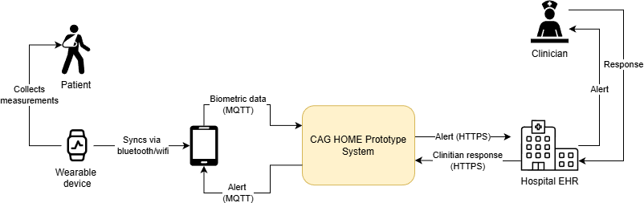
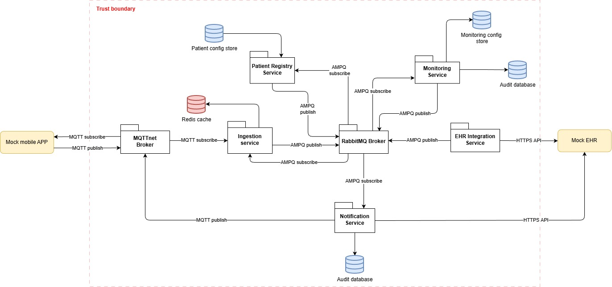

# CAG-Home
CAG-Home is a distributed event-driven healthcare prototype designed to simulate and process biometric data from wearable devices in a home-monitoring scenario. <br>
The system collects patient measurements through a mobile application, processes incoming telemetry in real time, evaluates monitoring conditions, and integrates <br>
alerts with an Electronic Health Record (EHR) system.

The platform is built using a microservice-oriented architecture with asynchronous messaging and observability built in from the start. It is intended for demonstration<br>
of scalable event-driven healthcare systems using modern .NET technologies and .NET Aspire.

### High-Level Workflow

The following diagram illustrates the overall system interaction between the patient, wearable device, mobile application, backend services, and EHR integration.



## Table of Contents

- [Technology Stack](#technology-stack)
- [System Architecture](#system-architecture)
- [Component Responsibilities](#component-responsibilities)
- [Setup](#setup)
- [Start the Project](#start-the-project)
- [Biometric Simulation Configuration](#biometric-simulation-configuration)
- [API Documentation](#api-documentation)
- [Observability](#observability)
- [RabbitMQ Management](#rabbitmq-management)

## Technology Stack

The prototype is built using the following technologies:

### Core Platform
- .NET 10
- .NET Aspire

### Messaging & Communication
- RabbitMQ
- WolverineFX
- MQTTnet

### Data Storage & Caching
- MongoDB
- Redis (StackExchange.Redis)

### Observability
- OpenTelemetry

### Testing
- xUnit
- NSubstitute

### Infrastructure & Development
- Docker Desktop

## System Architecture
The application is composed of several services communicating through MQTT and AMQP messaging patterns. Each component has a dedicated responsibility within the <br>
ingestion, monitoring, notification, and integration pipeline.



The architecture follows an event-driven design where services communicate asynchronously through RabbitMQ and MQTT, enabling loose coupling and independent <br>
scaling of components.

## Component Responsibilities

| Component | Responsible For |
|---|---|
| **Patient Registry Service** | - Update patient status and enrollment<br>- Propagate changes to downstream services tracking patient state |
| **MQTTnet Broker** | - Handle device connectivity<br>- Enforce topic-level authorization<br>- Provide quality-of-service guarantees |
| **Ingestion Service** | - Normalize received data<br>- Maintain in-memory cache of patient status |
| **Monitoring Service** | - Maintain care plans<br>- Evaluate monitoring rules<br>- Persist decision trail |
| **EHR Integration Service** | - Poll for patient registration updates from EHR<br>- Poll for clinician responses from EHR |
| **Notification Service** | - Send alerts to hospital<br>- Send alerts to patient<br>- Persist audit trail |
| **RabbitMQ Broker** | - Route events internally<br>- Decouple services<br>- Ensure reliable delivery between services |
| **Contracts Project** | - Define shared message contracts and DTOs between services |

## Setup
Install the following:
- [Visual Studio Code](https://code.visualstudio.com/download)
- [C# Dev Kit](https://marketplace.visualstudio.com/items?itemName=ms-dotnettools.csdevkit)
- [.NET 10](https://dotnet.microsoft.com/en-us/download/dotnet/10.0)
- [Docker Desktop](https://www.docker.com/products/docker-desktop/)
- [Aspire](https://aspire.dev/get-started/install-cli/)
- [Aspire VS Code extension](https://aspire.dev/get-started/aspire-vscode-extension/)

## Start the project in VS Code
In the **Debug** tab in the left sidebar:
Select **Launch AppHost (Aspire)** and press **Run**.  
The project will be built and started.  
At some point, you should see this in the debug console:

```
Starting dashboard...
Now listening on: https://localhost:17182
AppHost:  src\CagHome\CagHome.AppHost\CagHome.AppHost.csproj
Logs:  C:\Users\Albert\.aspire\cli\logs\apphost-29688-2026-03-18-11-36-07.log
Dashboard: https://localhost:17182/login?t=d445f2ce56d03ed929f7da56a3078ca9
Login to the dashboard at https://localhost:17182/login?t=d445f2ce56d03ed929f7da56a3078ca9
Distributed application started. Press Ctrl+C to shut down.
```

Click the login link if the page does not open automatically. 

### Alternative: Run from the command line

```bash
cd src/CagHome/CagHome.AppHost
aspire run
```

or

```bash
cd src/CagHome/CagHome.AppHost
dotnet run
```

### Expected Startup

After launching the application:

- Aspire Dashboard opens automatically
- RabbitMQ, MongoDB, and Redis containers start
- All services appear as healthy in the Aspire dashboard (after some time)
- The Mock Application begins publishing biometric measurements

## Biometric simulation configuration
The mock application project is `src/CagHome/CagHome.MockApplication`.

### Configure in appsettings
Update the `Simulator` section in:
- `src/CagHome/CagHome.MockApplication/appsettings.json`

Example:

```json
{
    "Simulator": {
        "Profile": "normal",
        "DeviceCount": 3,
        "PublishIntervalSeconds": 2
    }
}
```

Supported profile values are:
- `normal`
- `exercise`
- `arrhythmia`

If an invalid profile value is entered, the simulator defaults to `normal`.

### Change profile at runtime
The simulator uses runtime configuration reloading. While it is running, you can change `Simulator:Profile` in `appsettings.json` and save the file.

On the next publish cycle, the simulator picks up the new profile without restarting the process.

### Seeding patients
When you run the application for the first time, there will be no patients in the system. You can seed patients by sending a POST request to the Mock EHR API <br>
through postman, swagger or similar (see API Documentation below):
```https
POST https://localhost:{mock-ehr-port}/mock/patient
```

The body of the message should be a JSON object with the following structure:
```json
{
  "PatientId": "12345678-47ef-0002-9a7a-123456789123",
  "UpdatedAtUtc": "2026-05-28T16:09:00Z",
  "Careplan": 2, 
  "Status": 0
}
```
The port is found under the mock-ehr resource tab in the Aspire dashboard.
The careplan field is an integer corresponding to the care plan enum values: <br>
0: None
1. Valve disease
2. Coronary artery disease
3. Cardopmyopathy

The status field is an integer corresponding to the patient status enum values:
0. Active
1. Inactive
2. Deceased

## API Documentation

When the application is running through Aspire, HTTP endpoints can be explored using Swagger UI for the relevant services. <br>
Those being the Mock EHR and the Mock Application.

Start the project, then open the Swagger endpoint for the service you want to inspect. The ports can be found in the Aspire dashboard under the **resources** tab by <br>
clicking on a given project and navigating to the URL section 

Example:
```text
https://localhost:<service-port>/swagger
```
## Observability
### Traces
In the Aspire web dashboard, navigate to the "Traces" tab to see the traces emitted by the application. You can filter by service name, operation name, or custom <br>
attributes to find specific traces.
### Structured Logs
In the **Structured** tab in the dashboard, the structured logs are found. These show all logs for all components and can be filtered. The current configuration <br>
includes logs from CagHome with level **Information** or higher and other logs are only included if they have level **Warning** or higher. This can be configured <br>
in each project's appsettings like so:
```csharp
{
  "Logging": {
    "LogLevel": {
      "Default": "Warning",
      "CagHome": "Information",
      "Wolverine": "Warning",
      "RabbitMQ": "Warning"
    }
  }
}
```

### RabbitMQ Management 
The credentials for the RabbitMQ management UI can be found by clicking the *messaging* row in the Aspire resources tab. Scroll down to *Environment Variables*.

Click the URL from the *messaging* row and log in using the values from the variables:

- Username: RABBITMQ_DEFAULT_USER
- Password: RABBITMQ_DEFAULT_PASS
